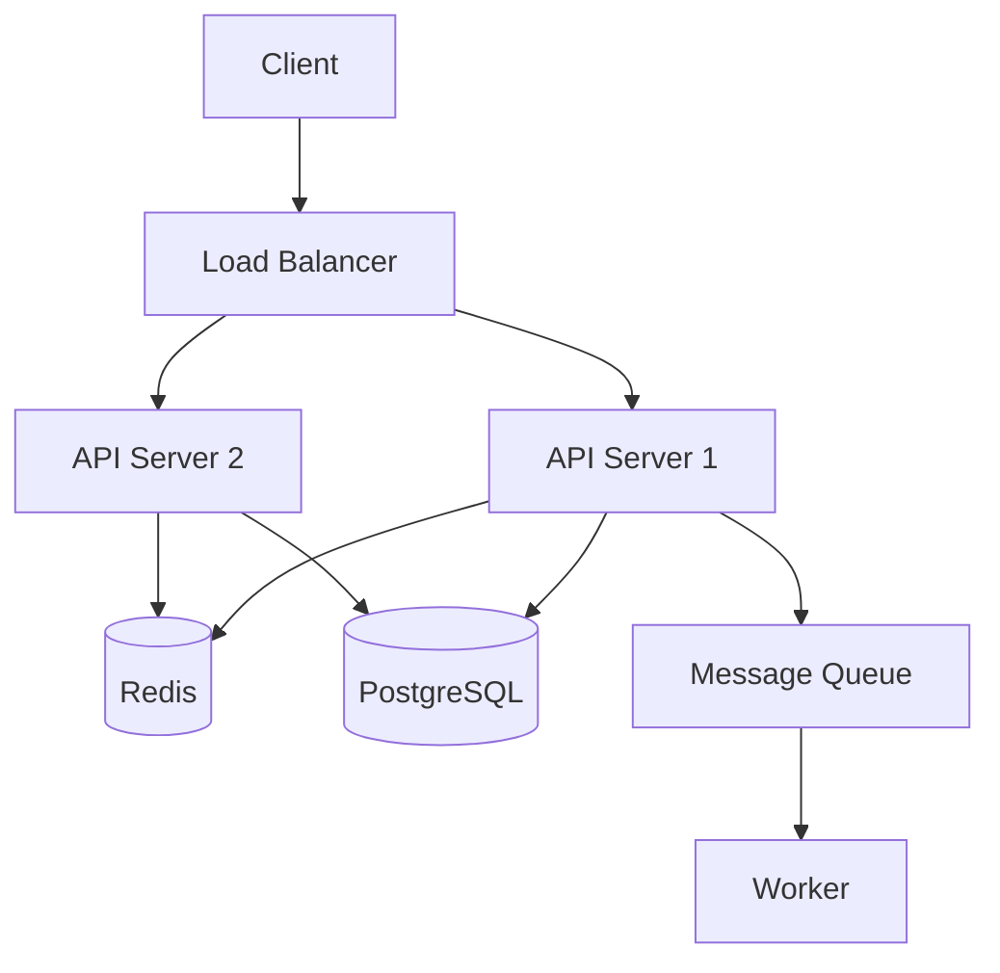
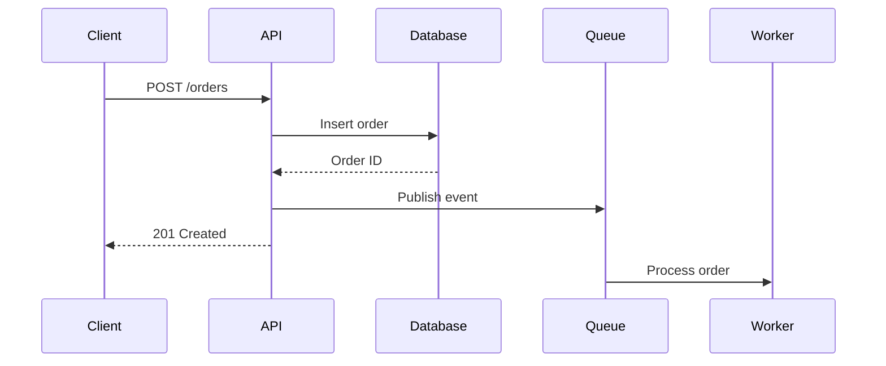

# Documentation Generation

Comprehensive guidance for generating and maintaining technical documentation.

## API Documentation

### OpenAPI/Swagger

```yaml
# openapi.yaml
openapi: 3.0.3
info:
  title: My API
  version: 1.0.0
  description: API for managing resources

servers:
  - url: https://api.example.com/v1

paths:
  /users:
    get:
      summary: List all users
      tags: [Users]
      parameters:
        - name: limit
          in: query
          schema:
            type: integer
            default: 20
      responses:
        '200':
          description: Successful response
          content:
            application/json:
              schema:
                type: array
                items:
                  $ref: '#/components/schemas/User'

components:
  schemas:
    User:
      type: object
      properties:
        id:
          type: string
          format: uuid
        email:
          type: string
          format: email
        name:
          type: string
      required: [id, email]
```

### Code Documentation

**JSDoc (JavaScript):**
```javascript
/**
 * Calculates the total price including tax.
 * @param {number} price - The base price
 * @param {number} [taxRate=0.1] - The tax rate (default 10%)
 * @returns {number} The total price with tax
 * @throws {Error} If price is negative
 * @example
 * calculateTotal(100, 0.2) // Returns 120
 */
function calculateTotal(price, taxRate = 0.1) {
  if (price < 0) throw new Error('Price cannot be negative');
  return price * (1 + taxRate);
}
```

**Python Docstrings:**
```python
def calculate_total(price: float, tax_rate: float = 0.1) -> float:
    """
    Calculate the total price including tax.

    Args:
        price: The base price (must be non-negative)
        tax_rate: The tax rate as a decimal (default: 0.1)

    Returns:
        The total price with tax applied

    Raises:
        ValueError: If price is negative

    Example:
        >>> calculate_total(100, 0.2)
        120.0
    """
    if price < 0:
        raise ValueError("Price cannot be negative")
    return price * (1 + tax_rate)
```

## README Templates

### Project README

```markdown
# Project Name

Brief description of what this project does.

## Features

- Feature 1
- Feature 2
- Feature 3

## Quick Start

\`\`\`bash
# Installation
npm install

# Run development server
npm run dev

# Build for production
npm run build
\`\`\`

## Configuration

| Variable | Description | Default |
|----------|-------------|---------|
| `PORT` | Server port | `3000` |
| `NODE_ENV` | Environment | `development` |

## API Reference

See [API Documentation](./docs/api.md)

## Contributing

See [CONTRIBUTING.md](./CONTRIBUTING.md)

## License

MIT License - see [LICENSE](./LICENSE)
```

## Architecture Diagrams

### Mermaid Diagrams



### Sequence Diagram



## Runbook Templates

### Incident Runbook

```markdown
# Service Name - Incident Runbook

## Service Overview
- **Purpose**: Brief description
- **Owner**: Team name
- **Criticality**: High/Medium/Low

## Health Checks

\`\`\`bash
# Check service status
curl -s https://api.example.com/health | jq

# Check logs
kubectl logs -l app=myapp --tail=100
\`\`\`

## Common Issues

### High CPU Usage

**Symptoms**: Response times > 2s, CPU > 80%

**Diagnosis**:
\`\`\`bash
kubectl top pods -l app=myapp
\`\`\`

**Resolution**:
1. Scale horizontally: `kubectl scale deployment myapp --replicas=5`
2. Check for memory leaks
3. Review recent deployments

### Database Connection Errors

**Symptoms**: 500 errors, connection timeout logs

**Diagnosis**:
\`\`\`bash
# Check connection pool
kubectl exec -it myapp-pod -- pg_isready -h $DB_HOST
\`\`\`

**Resolution**:
1. Check database status
2. Verify credentials
3. Check network connectivity

## Escalation

| Level | Contact | When |
|-------|---------|------|
| L1 | On-call | Any alert |
| L2 | Team lead | > 15 min unresolved |
| L3 | SRE | Service down > 30 min |
```

## Documentation Tools

| Tool | Purpose |
|------|---------|
| Docusaurus | Documentation sites |
| MkDocs | Python-friendly docs |
| Storybook | Component docs |
| Swagger UI | API explorer |
| Mermaid | Diagrams in markdown |
| PlantUML | UML diagrams |

## Generation Commands

```bash
# Generate API docs from OpenAPI
npx @redocly/cli build-docs openapi.yaml

# Generate TypeScript docs
npx typedoc src/index.ts

# Generate Python docs
sphinx-build -b html docs/ docs/_build

# Generate from JSDoc
npx jsdoc src/ -d docs/
```

## Additional Resources

### Reference Files

- **`references/readme-templates.md`** - README templates collection
- **`references/diagram-examples.md`** - Mermaid diagram examples

### Example Files

- **`examples/openapi-full.yaml`** - Complete OpenAPI specification
- **`examples/runbook-template.md`** - Runbook template
